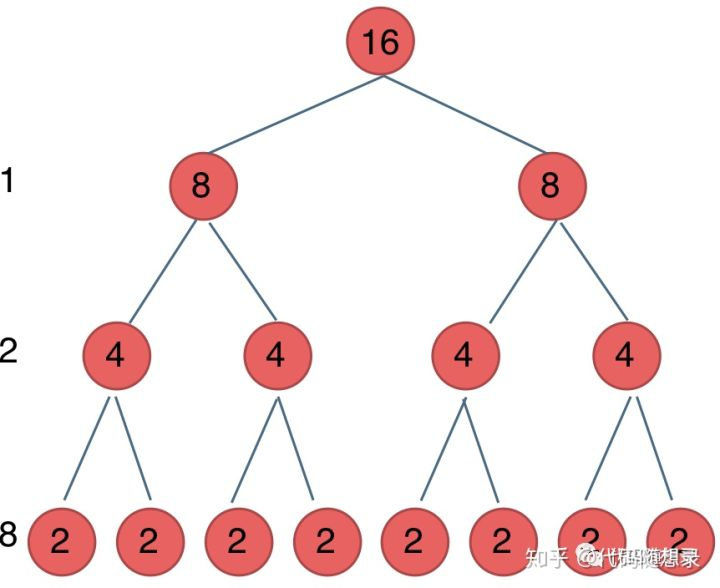

来看一下这道面试题：求x的n次方

大家想一下这么简单的一道题目 代码应该如何写。

最直观的方式应该就是，一个for循环求出结果，代码如下
```
int function1(int x, int n) {
    int result = 1;  // 注意 任何数的0次方等于1
    for (int i = 0; i < n; i++) {
        result = result * x;
    }
    return result;
}
```
时间复杂度为O(n)

此时面试官会说，有没有效率更好的算法呢。

如果同学们此时没有思路，建议不要说：我不会，我不知道。可以和面试官探讨一下，问：可不可以给点提示。

面试官一般会提示：考虑一下递归算法

有的同学就写出了如下这样的一个递归的算法，使用递归解决了这个问题
```
int function2(int x, int n) {
    if (n == 0) {
        return 1; // return 1 同样是因为0次方是等于1的
    }
    return function2(x, n - 1) * x;
}
```
面试官问：那么这份代码的时间复杂度是多少？

有的同学可能一看到递归就想到了logn，其实并不是这样

递归算法的时间复杂度本质上是要看: 递归的次数 * 每次递归中的操作次数

那我们再来看代码，我们递归了几次呢。

每次n-1，递归了n次 时间复杂度是O(n)，每次进行了一个乘法操作，乘法操作的时间复杂度一个常数项O(1)

所以这份代码的时间复杂度是 n * 1 = O(n)

这个时间复杂度可能就没有达到面试官的预期。

于是同学又写出了这样的一个递归的算法的代码如下 ，来求 x的n次方
```
int function3(int x, int n) {
    if (n == 0) {
        return 1;
    }
    if (n % 2 == 1) {
        return function3(x, n/2) * function3(x, n/2)*x;
    }
    return function3(x, n/2) * function3(x, n/2);
}
```
面试官看到后微微一笑，问这份代码的时间复杂度又是多少呢？

我们来分析一下

首先看递归了多少次呢，可以把递归的次数 抽象出一颗满二叉树。

我们刚刚写的这个算法，可以用一颗满二叉树来表示（为了方便表示 我选择n为偶数），如图：




当前这颗二叉树就是求x的n次方，n为16的情况

n为16的时候 我们进行了多少次乘法运算呢

这棵树上每一个节点就代表着一次递归并进行了一次相乘操作

所以 进行了多少次递归的话，就是看这棵树上有多少个节点。

熟悉二叉树的同学应该知道如何求满二叉树节点数量

这颗满二叉树的节点数量就是2^3 + 2^2 + 2^1 + 2^0 = 15

有同学就会发现 这其实是等比数列的求和公式， 如果不理解的同学可以直接记下来这个结论。

这个结论在二叉树相关的面试题里也经常出现。

这么如果是求x的n次方，这个递归树有多少个节点呢，如下图所示


时间复杂度忽略掉常数项-1之后，我们发现这个递归算法的时间复杂度依然是O(n)。


此时面试官就会问， 貌似这个递归的算法依然还是O(n)啊， 很明显没有达到面试官的预期

那么在思考一下 O(logn)的递归算法应该怎么写

这里在提示一下 上面刚刚给出的那份递归算法的代码，是不是有哪里比较冗余呢。

来看这份优化后的递归算法代码
```
int function4(int x, int n) {
    if (n == 0) {
        return 1;
    }
    int t = function4(x, n/2);// 这里相对于function3，是把这个递归操作抽取出来
    if (n % 2 == 1) {
        return t*t*x;
    }
    return t*t;
}```
那我们看一下 时间复杂度是多少

依然还是看他递归了多少次

我们可以看到 这里仅仅有一个递归调用，且每次都是 n/2

所以这里我们一共调用了 log以2为底n的对数次

每次递归了做都是一次乘法操作，这也是一个常数项的操作，

所以说这个递归算法的时间复杂度才是真正的O(logn)。

https://www.zhihu.com/question/63075755